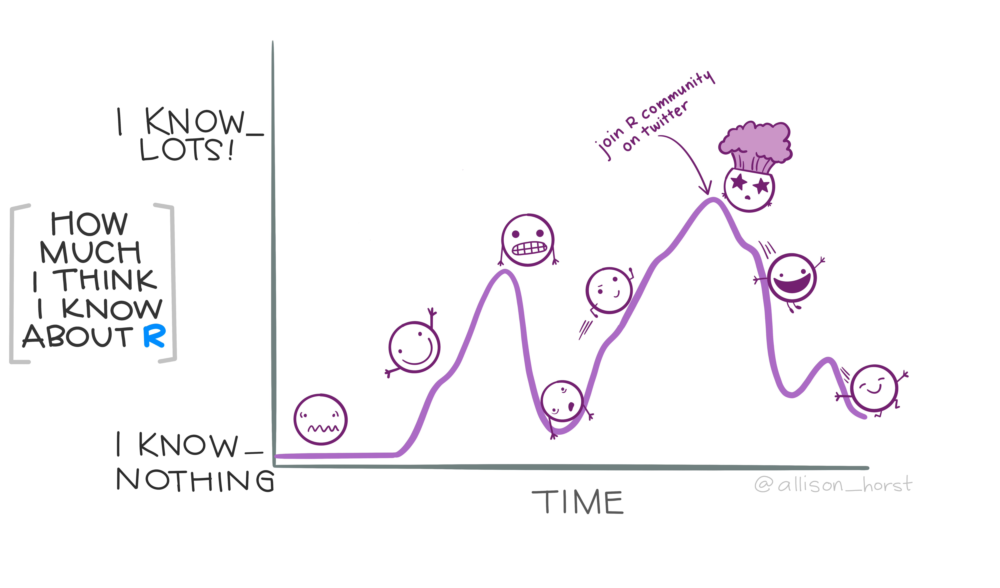
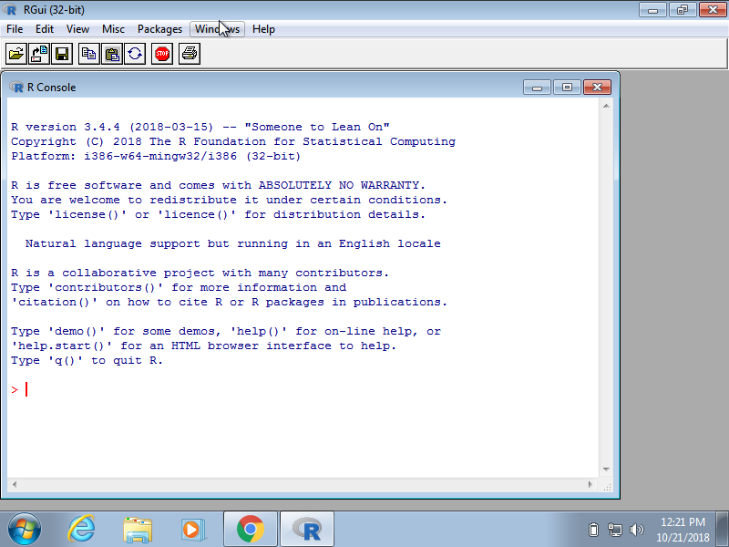
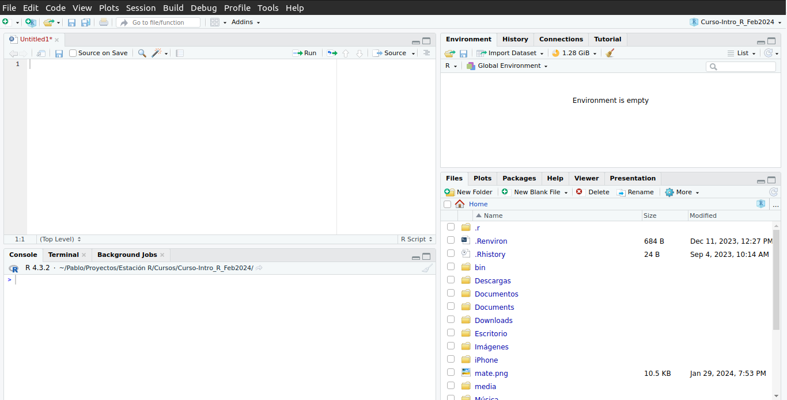
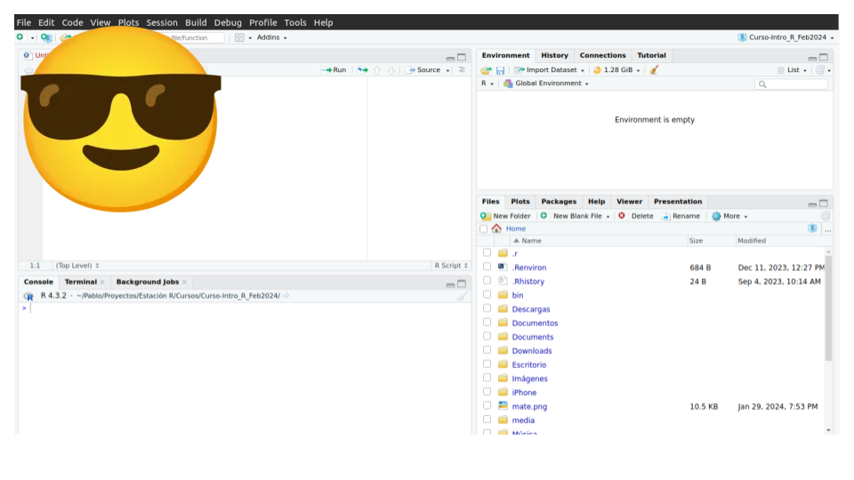
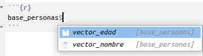

# Bienvenidos y bienvenidas a Estación R

::: columns
::: {.column width="50%"}
💬 [Slack](https://join.slack.com/t/estacion-r/shared_invite/zt-2smy7t4ae-1KDZLHN1aqXmZXdKbc5buA)

🔗 [Web](https://estacion-r.netlify.app/)

🐘 [Mastodon](https://botsin.space/@r_tips)

𝕏 [X](https://twitter.com/estacion_erre)

✉️ [Correo](mailto:pablotiscornia@estacion-r.com)
:::

::: {.column width="50%"}
[Instagram](https://www.instagram.com/estacion_ere?igsh=OWhtcWR5ZGkwb3Bw&utm_source=qr)

[LinkedIn](https://www.linkedin.com/company/estacion-r/)
:::
:::

# Sobre el curso

-   Dinámica de la clase

    ```         
    - Ejercitación semanal

    - Tp Integrador

    - Grabación de encuentros
    ```

# Presentación

👋 Presentate [acá](https://docs.google.com/document/d/10MfUrYuR66ZB1e9OznpzsKQQBXtdPO1GTy_4aPhRLf4/edit?usp=sharing)

## Hoja de Ruta

::: columns
::: {.column width="50%"}
📌 ¿Qué es R?

📌 ¿Qué es la Ciencia de Datos?

📌 R != Rstudio
:::

::: {.column width="50%"}
📌 Conceptos básicos de R

```         
  👉🏼 Valores

  👉🏼 Vectores

  👉🏼 Tipos / Clases

  👉🏼 Data Frames
```
:::
:::

# ¿Qué es R?

## Primera impresión


## Evolución emocional

{fig-alt="r project console"}

## R ... {.center auto-animate="true"}

-   Es un lenguaje de programación especializado en análisis y visualización de datos.

## R ... {.center auto-animate="true"}

-   Es de código abierto (se puede usar y modificar sin pagar licencias ni costos de ningún tipo)

## R ... {.center auto-animate="true"}

-   Crece a partir del aporte de su comunidad (no depende de un departamento de desarrollo):
    -   Academia (Universidades)
    -   Investigación Científica (Centros de investigación, comunidad científica)
    -   Sector privado (Facebook, Google, X, Uber, Airbnb, IBM, New York times)
    -   Gente de a pie (personas o grupos de personas)

## R ... {.center auto-animate="true"}

-   En el campo del análisis de datos, es la herramienta por excelencia en muchas universidades, empresas de tecnología, y redacciones de periodismo de datos.

# ¿Qué es la Ciencia de Datos?

## ¿Qué es la Ciencia de Datos?

{fig-alt="r project console"}

# R != Rstudio

## R != Rstudio

::: columns
::: {.column width="50%"}
{fig-alt="r project console"}
:::

::: {.column width="50%"}
{fig-alt="R studio console"}
:::
:::

## R != Rstudio

::: columns
::: {.column width="50%"}
{fig-alt="r project console"}
:::

::: {.column width="50%"}
{fig-alt="R studio console"}
:::
:::

# Vamos a Rstudio!

## Puesta a punto ... {auto-animate="true"}

-   Identificar las 4 ventanas principales

## Puesta a punto ... {auto-animate="true"}

-   Identificar las 4 ventanas principales ✅

<br>

-   Cambiar la apariencia de la plataforma

## Puesta a punto ... {auto-animate="true"}

-   Identificar las 4 ventanas principales ✅

<br>

-   Cambiar la apariencia de la plataforma ✅

<br>

-   Setear en **Opciones Globales** (*Global Options*) la configuración **General**

## Puesta a punto ... {auto-animate="true"}

-   Identificar las 4 ventanas principales ✅

<br>

-   Cambiar la apariencia de la plataforma ✅

<br>

-   Setear en **Opciones Globales** (*Global Options*) la configuración **General** ✅

# Descanso

```{r echo=FALSE}
library(countdown)

contador <- countdown(minutes = 10, bottom = 0, warn_when = 60, blink_colon = TRUE)
```

`r contador`

# Conceptos básicos de R

## Valores ... {.center auto-animate="true"}

## Valores ... {.center auto-animate="true"}

#### numéricos

```{r}
100
```

## Valores ... {.center auto-animate="true"}

#### de texto

```{r}
"cien"
```

## Valores ... {.center auto-animate="true"}

#### ¿?

``` r
"100"
```

## Vectores ... ¿variables? {.center auto-animate="true"}

## Vectores ... ¿variables? {.center auto-animate="true"}

#### numéricos

```{r}
c(100, 102, 200)
```

## Vectores ... ¿variables? {.center auto-animate="true"}

#### de texto

```{r}
c("cien", "ciento dos", "doscientos")
```

## Vectores ... ¿variables? {.center auto-animate="true"}

#### de texto

```{r}
c("100", "102", "200")
```

## Funciones

-   Las funciones en R son el alma mater del lenguaje (de todos los lenguajes)

-   ellas reciben un [input]{style="color: green;"} y devuelven un [output]{style="color: red;"}

-   Siempre las encontrarás escrita así:

`nombre_de_la_funcion(input)`

## Funciones

-   La función `class()` devuelve el tipo del valor o vector que le de ([input]{style="color: green;"})

```{r}
class(1)
```

## Funciones

```{r}
class("1")
```

## Funciones

-   La función `length()` devuelve el largo del input (probemos con un vector):

```{r}
length(c(10, 20, 30))
```

## Funciones

-   La función `mean()` calcula el promedio de un input (tiene que ser si o si numérico):

```{r}
mean(c(10, 20, 30))
```

## Funciones

```{r}
mean(c("10", "20", "30"))
```

## Objetos

-   Todo en R puede ser guardado en un objeto (un valor, un vector, el resutlado de una función, y más)

## Objetos

-   Todo en R puede ser guardado en un objeto (un valor, un vector, el resutlado de una función, y más)

-   Para guardar *algo* en un objeto, tengo que seguir la siguiente estructura:

``` r
nombre_del_objeto <- algo
```

## Objetos

```{r}
guardo_un_numero <- 1
```

## Objetos

```{r}
guardo_un_numero
```

## Objetos

```{r}
guardo_un_vector <- c(10, 20, 30)
```

## Objetos

```{r}
guardo_un_vector
```

## Objetos

```{r}
guardo_un_resultado <- mean(c(20, 45, 23))
```

## Objetos

```{r}
guardo_un_resultado
```

## Objetos

```{r}
objeto_como_input <- c(20, 45, 23)

mean(objeto_como_input)
```

# Ejercitación

## Ejercitación

-   Crear un objeto con los siguientes **5 valores numéricos: 17, 92, 56, 32 y 102**, y llamarlo `edad_personas`.

-   Con la función `class()` chequear de qué tipo es el objeto.

-   Con la función `length()` conocer la longitud de ese objeto (cuántos valores tiene).

-   Calcular el promedio de esos valores (la edad promedio)

# Data Frames

## Data Frames

-   Un Data Frame (o tabla) es la combinación de vectores (variables), que termina conformando una relación entre filas y columnas.

-   Cada **vector** es una columna de un `dataframe`, y cada uno de sus valores, en el orden en que se encuentran, conforman las filas.

## Data Frames

-   Para crear un Data Frame puedo utilizar la función `data.frame()`, cuyos inputs son los vectores:

```{r}
vector_edad <- c(20, 43, 102, 56)
vector_nombre <- c("Pepe", "Pepa", "Rigoberto", "Rodoberta")

base_personas <- data.frame(vector_edad,
                            vector_nombre)
```

## Data Frames

-   Así se ve un data.frame:

```{r}
base_personas
```

# Accediendo a un Data Frame {.center}

> Recordar este comando: `$`

## Accediendo a un Data Frame

-   Con el comando `$` (símbolo peso) puedo acceder a una columna del data frame:

{width="20%"}

## Accediendo a un Data Frame

```{r}
base_personas$vector_nombre
```

## Accediendo a un Data Frame

El resultado de `base_personas$vector_nombre` es nuevamente un vector, por lo que puedo:

```{r}
class(base_personas$vector_nombre)
```

```{r}
length(base_personas$vector_nombre)
```

# Ejercitación

## Ejercitación

-   Crear un vector llamado `serie`, cuyos valores son: `"Berlín", "The Crown"` y `"Vikings"`.

-   Crear un vector llamado `puntaje`, cuyos valores son (agregar puntaje a gusto),

-   Crear un `data.frame` llamado `netflix`, que combine los vectores anteriores

-   Calcular el puntaje promedio de las series de Netflix.

## ¡Listo!

-   Nos vemos el encuentro que viene.

-   Seguimos la comunicación entre clase y clase por **Slack**

-   [Acá](encuentros/1-intro-r/intro-r_ejercitacion) dejamos más ejercitación para seguir practicando
