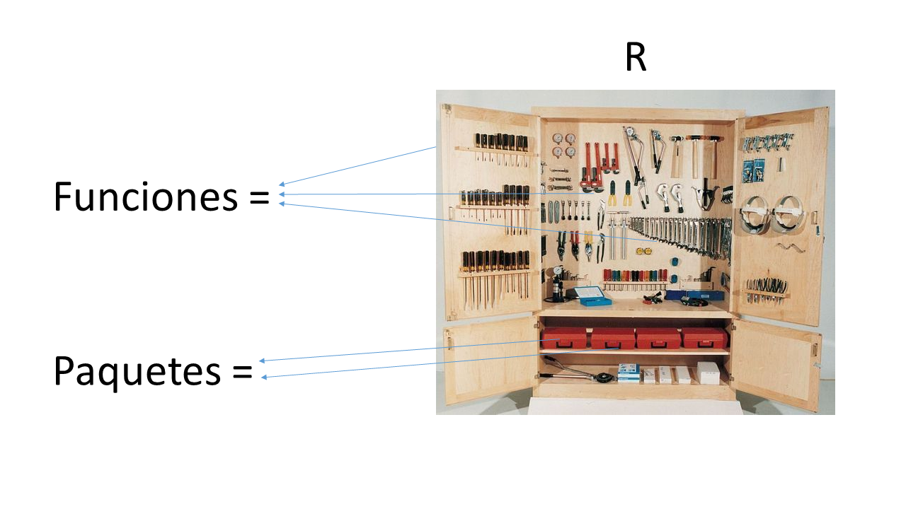
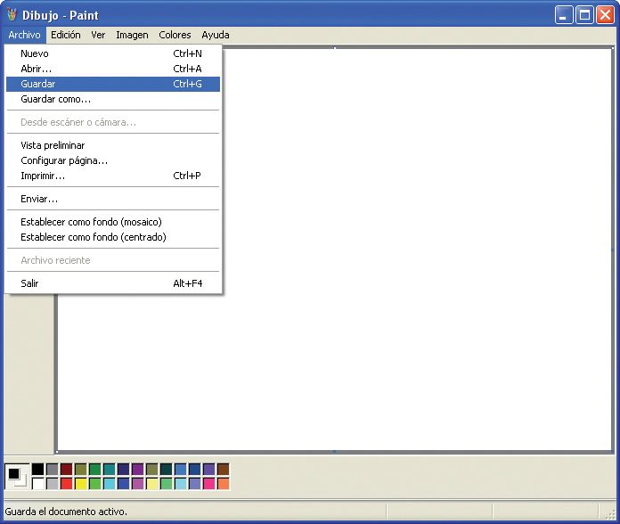
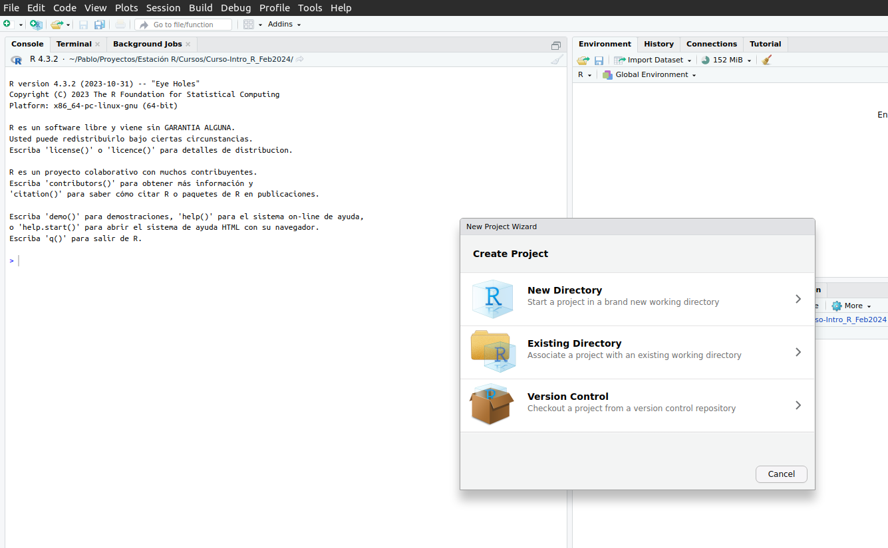
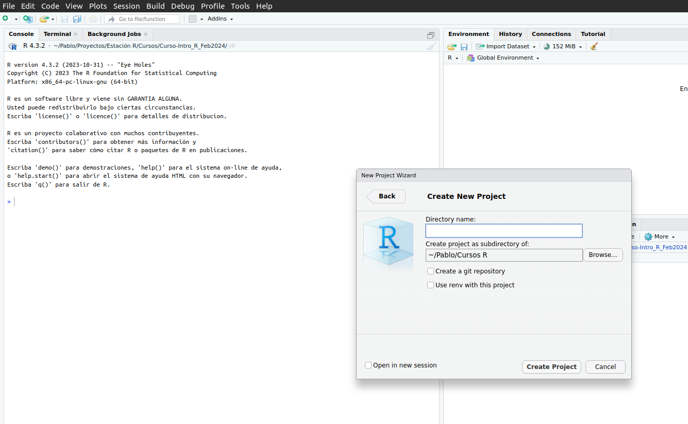
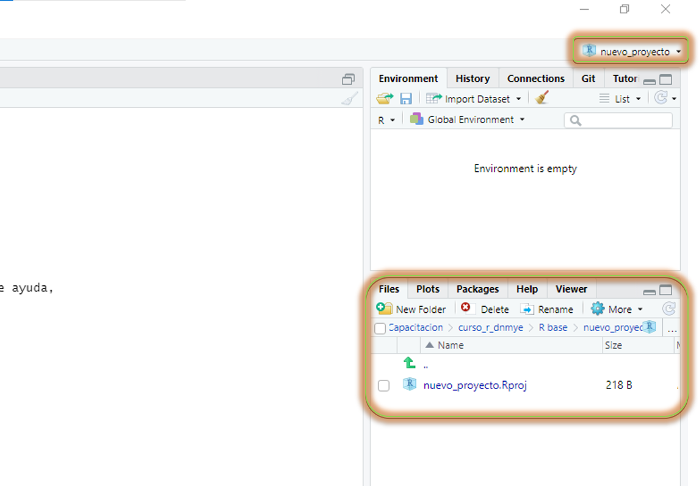

# Bienvenidos y bienvenidas a Estación R

::: columns
::: {.column width="50%"}
💬 [Slack](https://join.slack.com/t/estacion-r/shared_invite/zt-2cktmesg3-11HhUxMFmynQe18ZsBkVpA)

🔗 [Web](https://estacion-r.netlify.app/)

🐘 [Mastodon](https://botsin.space/@r_tips)

𝕏 [X](https://twitter.com/estacion_erre)

✉️ [Correo](mailto:pablotisco@gmail.com)
:::

::: {.column width="50%"}
[Instagram](https://www.instagram.com/estacion_ere?igsh=OWhtcWR5ZGkwb3Bw&utm_source=qr)

[LinkedIn](https://www.linkedin.com/company/estacion-r/)
:::
:::

------------------------------------------------------------------------

## ¿Qué vimos?

✅ Valores

✅ Vectores

✅ Data frames

✅ Objetos

✅ Funciones

## Hoja de Ruta

::: columns
::: {.column width="50%"}
📌 Paquetes

📌 Ruta de un archivo (o *file path*)

📌 Importar nuestra primera base de datos
:::

::: {.column width="50%"}
📌 Armar un proyecto de trabajo en Rstudio (*R project*)

📌 Estructura de carpeta

```         
  👉🏼 Cómo estructurar la carpeta de trabajo

  👉🏼 Cómo nombrar archivos
```
:::
:::

# Paquetes

## Paquetes



## Paquetes

-   Los paquetes o librerías son la potencia de los lenguajes como R y Python

-   Es cómo las comunidades pueden hacer crecer al lenguaje

](images/mapa_cran.png)

## Paquetes

> Se **instala** (una vez por computadora)

``` r
install.packages("nombre_del_paquete")
```

<br>

> Se **convoca** (por cada sesión de R)

``` r
library(nombre_del_paquete)
```

## Paquetes

> Para *instalar* un paquete (`install.packages()`), el nombre del paquete va **siempre** entre comillas

```{r eval=FALSE}
install.packages("readr")
```

<br>

## Paquetes

> Para *instalar* un paquete (`install.packages()`), el nombre del paquete va **siempre** entre comillas

```{r eval=FALSE}
install.packages("readr")
```

<br>

> Para *convocar* un paquete (`library()`) el nombre puede o no llevar comillas (se recomienda **sin**)

```{r}
library(readr)
```

## Paquetes

-   Instalemos nuestro primer paquete:

``` r
install.packages("readr")
```

## Paquetes

-   Instalemos nuestro primer paquete:

``` r
install.packages("readr")
```

-   ¿Mucha letra roja?

## Paquetes

::: columns
::: {.column width="50%"}
-   Convoquemos al paquete

```{r}
library(readr)
```
:::

::: {.column width="50%"}
<br>


:::
:::

# Ruta de archivos

-   **Definición:** Ubicación de una carpeta / archivo en mi computadora

-   **Máxima:** Todas las carpetas en nuestra computadora tienen una ***ruta***

## Ruta de archivos

-   **Ejemplo diario de seleccionar una *ruta de archivo*:**

{width: "70%";}

## Importar datos

-   Vamos a descargar una base de datos y ubicarla en una carpeta conocida de mi computadora.

-   **Base de datos:** *Nombre de Personas. Argentina, año 2015.*

> [Link](https://datos.gob.ar/dataset/otros-nombres-personas-fisicas)

## Importar datos

-   Vamos a descargar una base de datos y ubicarla en una carpeta conocida de mi computadora.

**- Base de datos:** *Nombre de Personas. Argentina, año 2015.*

[Link](https://datos.gob.ar/dataset/otros-nombres-personas-fisicas)

-   Tip: Reconocer la ***extensión*** del archivo a descargar (.csv, .txt, .sav, .dta, .sas, etc.)

## Importar datos

-   Manos a la obra:

``` r
library(readr)

read_csv(file = "/home/pablote/Documentos/datos/nombres-2015.csv")
```

## Importar datos

-   Falta algo...

## Importar datos

-   Falta algo...

``` r
base_personas <- read_csv(file = "/home/pablote/Documentos/datos/nombres-2015.csv")
```

# Descanso

```{r echo=FALSE}
library(countdown)

contador <- countdown(minutes = 10, bottom = 0, warn_when = 60, blink_colon = TRUE, play_sound=here::here("encuentros/1-intro-r/images/inst_adlibs_birdman1.wav"))
```

`r contador`

# Proyectos de trabajo {.center auto-animate="true"}

{width="250" height="200" style="display: block; margin: 0 auto"}

## Proyectos de trabajo

<br>

<br>

-   Copiar la siguiente sentencia en tu consola o script y ejecutar:

``` r
base_personas <- read_csv(file = "/home/pablote/Documentos/datos/nombres-2015.csv")
```

## Proyectos de trabajo

<br>

<br>

::: incremental
-   Si compartimos el script a otra persona, **el código se rompe**

-   Si cambiamos de computadora, **el código se rompe**

-   Si cambiamos la base de lugar, **el código se rompe**
:::

# La solución


## Crear un proyecto de Rstudio

-   Paso 1:

--\> **File (*archivo*) --\> New Project (*Nuevo Proyecto...*)**



## Crear un proyecto de Rstudio

-   Paso 2:

--\> **New Directory (*Nueva carpeta*)**


## Crear un proyecto de Rstudio

-   Paso 3:

--\> **New Project**



## Crear un proyecto de Rstudio

-   Resultado:



# Manos a la obra

## Crear un proyecto de Rstudio

-   Asegurarse que estamos en el proyecto, de lo contrario, abrirlo

## Crear un proyecto de Rstudio

-   Asegurarse esta en el proyecto, de lo contrario, abrirlo ✅

-   Crear una carpeta nueva llamada `datos`

## Crear un proyecto de Rstudio

-   Asegurarse esta en el proyecto, de lo contrario, abrirlo ✅

-   Crear una carpeta nueva llamada `datos` ✅

-   Guardar la base de personas en la carpeta `datos`

## Crear un proyecto de Rstudio

-   Asegurarse esta en el proyecto, de lo contrario, abrirlo ✅

-   Crear una carpeta nueva llamada `datos` ✅

-   Guardar la base de personas en la carpeta `datos` ✅

-   Ejecutar la siguiente sentencia:

``` r
library(readr)

base_personas <- read_csv("datos/nombres-2015.csv")
```

## Crear un proyecto de Rstudio

-   **Antes** *(sin un proyecto)*

``` r
base_personas <- read_csv(file = "/home/pablote/Documentos/datos/nombres-2015.csv")
```

## Crear un proyecto de Rstudio

-   **Antes** *(sin un proyecto)*

``` r
base_personas <- read_csv(file = "/home/pablote/Documentos/datos/nombres-2015.csv")
```

<br>

-   **Después** *(con un proyecto)*

``` r
base_personas <- read_csv("datos/nombres-2015.csv")
```

## Estructura de carpetas

-   📂 nuevo_proyecto

    -    *nuevo_proyecto.Rproj*

    -   📂 datos

        -   ⛁ *nombres-2015.csv*

    -   📂 outputs

    -   📂 scripts

        -   📄 *1_levantar_datos.R*

    -   📂 docs_metodologicos

        -   📚 *bibliografia.docx*
