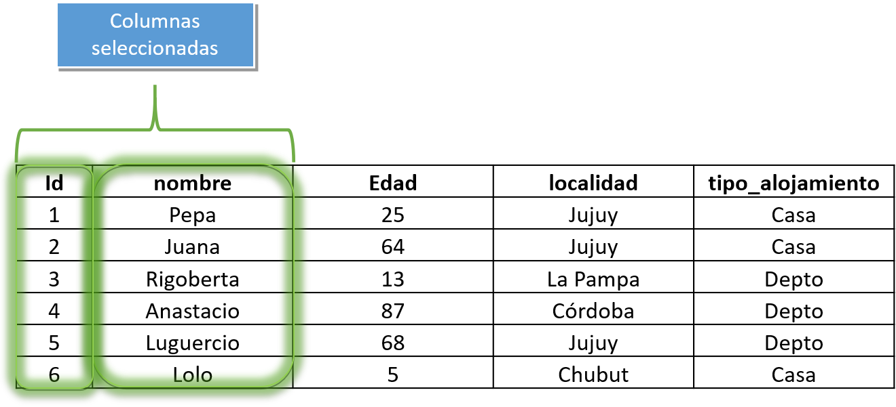
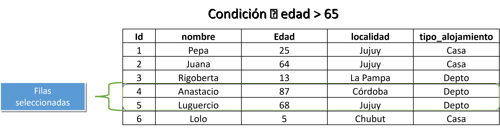

# Bienvenidos y bienvenidas a Estación R

::: columns
::: {.column width="50%"}
💬 [Slack](https://join.slack.com/t/estacion-r/shared_invite/zt-2cktmesg3-11HhUxMFmynQe18ZsBkVpA)

🔗 [Web](https://estacion-r.netlify.app/)

🐘 [Mastodon](https://botsin.space/@r_tips)

𝕏 [X](https://twitter.com/estacion_erre)

✉️ [Correo](mailto:pablotisco@gmail.com)
:::

::: {.column width="50%"}
[Instagram](https://www.instagram.com/estacion_ere?igsh=OWhtcWR5ZGkwb3Bw&utm_source=qr)

[LinkedIn](https://www.linkedin.com/company/estacion-r/)
:::
:::

------------------------------------------------------------------------

## ¿Qué vimos?

<br>

✅ Conceptos básicos de R (valores, vectores, data.framtes, funciones, objetos)

<br>

✅ Cómo armar y organizar un proyecto de trabajo

<br>

✅ Qué son los paquetes (o librerías)

## Hoja de Ruta

::: columns
::: {.column width="50%"}
📌 ¿Qué es la Ciencia de Datos?

<br>

📦 Paquete `{dplyr}`

```         
🔧 `select()` 🔧 `filter()` 

🔧 `mutate()` 🔧 `rename()` 

🔧 `arrange()` 

🔧 `group_by()` 🔧 `summarise()`  

🔧 `joins` 
```
:::

::: {.column width="50%"}
📌 La pipa (`|>` o `%>%`)

<br>

📦 Paquete `{tidyr}`

```         
🔧 `pivot_longer()` 🔧 `pivot_wider()`  
```
:::
:::

## Configuración para esta clase

<br>

-   Armar un proyeto de trabajo nuevo

-   Crear una carpeta en el llamada `datos`

-   Descargar la base del [**Padrón Único Nacional de Alojamientos**](https://datos.yvera.gob.ar/dataset/padron-unico-nacional-alojamiento) (Argentina) y ubicarla en la carpeta `datos`

-   Crear un **script** de trabajo

# ¿Qué es la Ciencia de Datos?

## ¿Qué es la Ciencia de Datos?

{fig-alt="r project console"}

# `{tidyverse}`

## ¿Qué es `{tidyverse}`?

::: incremental
-   Una colección de paquetes.

-   Comparten una filosofía acerca de los datos y la programación en R ("*tidy*" -*ordenado*-).

-   Tienen una coherencia para ser utilizados en conjunto.

-   Orientado a ser leído y escrito por y para seres humanos.

-   Una comunidad, basada en los principios del código abierto y trabajo colaborativo.
:::

## ¿Qué es `{tidyverse}`?


## `{tidyverse}`

<br>

-   Instalación:

``` r
install.packages("tidyverse")
```

## `{tidyverse}`

<br>

-   Cargo el paquete:

```{r message=TRUE, warning=TRUE}
library(tidyverse)
```

## `{tidyverse}`

-   Nos evita tener que instalar uno por uno a cada paquete:

``` r
install.packages("dplyr")
install.packages("tidyr")
install.packages("ggplot2")
```

<br>

-   Como también tener que convocarlos de a uno:

``` r
library(dplyr)
library(tidyr)
library(ggplot2)
```

# La pipa

## Un operador llamado `pipa`

<br>

<br>

::: columns
::: {.column width="50%"}
<br>

```{r eval=FALSE}
base_de_datos |> 
  funcion1 |> 
  funcion2 |>  
  funcion3
```
:::

::: {.column width="50%"}

:::
:::

## Un operador llamado `pipa`

<br>

-   Pipa de **R base**: `|>`

<br>

-   Pipa de **{magritr}**: `%>%`

## Ejemplo:

<br> <br>

```{r}
datos <- data.frame(nombre = c("Pirulanzo", "Rodogovia", "Rodogovia", "Rodogovia"),
                    edad = c(23, 12, 87, 32))

datos
```

## Ejemplo:

-   Quiero calcular qué proporción de personas se llaman *Rodogovia*

<br>

-   Antes (*sin el pipe*):

```{r}
round(prop.table(table(datos$nombre)), digits = 1)
```

## Ejemplo:

<br>

-   Después (*con el pipe*):

```{r}
datos$nombre |> 
  table() |> 
  prop.table() |> 
  round(digits = 1)
```

# 

```{r echo=FALSE, out.width = '30%', fig.align = 'center'}
knitr::include_graphics("images/logo dplyr.png")
```

## Funciones del paquete dplyr:

<br>

| **Función**   |                            **Acción** |
|:--------------|--------------------------------------:|
| `select()`    |     *selecciona o descarta variables* |
| `filter()`    |                    *selecciona filas* |
| `mutate()`    |              *crea / edita variables* |
| `rename()`    |                  *renombra variables* |
| `group_by()`  | *segmenta en funcion de una variable* |
| `summarize()` |         *genera una tabla de resúmen* |

# **select()**

<html>

<hr color='#EB811B' size=1px width=1600px>

</html>

<html>

```{=html}
<p style="color:grey;" align:"left">Elige o descarta columnas de una base de datos</p>
```
</html>

## `select()`

<br>

-   La función tiene la siguiente estructura:

```{r}
#| eval: false
base_de_datos |> 
  select(id, nombre) #<<
```

```{r echo=FALSE, fig.align = 'center', out.width='65%'}

```

## Caso práctico

```{r}
#| include: false
#| echo: false
library(readr)
df_puna <- read_csv(here::here("data/puna_base_agregada.csv"))
```

``` r
# Cargo paquete
library(readr)

# Importo datos
df_puna <- read_csv("datos/puna_base_agregada.csv")
```

<br>

```{r}
# Exploro la base
colnames(df_puna)
```

## Caso práctico

<br>

-   **Pedido:** La coordinadora me ha solicitado conocer la cantidad de plazas que hay por localidad y, si es posible, saber de qué tipo son los alojamientos

<br>

-   Variables de trabajo:

    -   *localidad*
    -   *plazas*
    -   *tipo*

## Caso práctico

<br>

-   Selecciono las 3 columnas de interés

```{r}
#| eval: false
#| code-line-numbers: "3,4"
library(tidyverse)

df_puna |> 
  select(localidad, tipo, plazas)
```

## Caso práctico

<br>

-   Selecciono las 3 columnas de interés

```{r}
#| code-line-numbers: "2"
library(tidyverse)

df_puna_sel <- df_puna |> 
  select(localidad, tipo, plazas)
```

<br>

-   Chequeo las columnas del nuevo objeto

```{r}
#| code-line-numbers: "1"
colnames(df_puna_sel)
```

# Otras formas de seleccionar...

## `select()` - *por posición*

<br>

1.  Chequeo la posición:

```{r}
colnames(df_puna)
```

## `select()` - *por posición*

<br>

2.  Selecciono

```{r}
#| code-line-numbers: "2"
df_puna_sel_posicion <- df_puna |> 
  select(7, 9, 13)
```

## `select()` - *por posición*

<br>

3.  Chequeo

```{r}
colnames(df_puna_sel_posicion)
```

## `select()` - *por posición (columnas consecutivas)*

<br>

```{r}
#| code-line-numbers: "2"
df_puna_sel_posicion2 <- df_puna |> 
  select(1:3)
```

## `select()` - *por posición (columnas consecutivas)*

<br>

```{r}
#| code-line-numbers: "2"
df_puna_sel_posicion2 <- df_puna |> 
  select(1:3)
```

<br>

```{r}
colnames(df_puna_sel_posicion2)
```

#  {.center auto-animate="true"}


## `select()` - *por nombre (consecutiva)*

<br>

```{r}
#| code-line-numbers: "2"
df_puna_sel_posicion3 <- df_puna |> 
  select(establecimientos:plazas)
```

## `select()` - *por nombre (consecutiva)*

<br>

```{r}
#| code-line-numbers: "2"
df_puna_sel_posicion3 <- df_puna |> 
  select(establecimientos:plazas)
```

<br>

```{r}
colnames(df_puna_sel_posicion3)
```

# 


## `select()` - *Por patrones de texto*

<br>

**Trío:**

-   `starts_with()` --\> *empieza con...*

-   `ends_with()` --\> *termina con...*

-   `contains()` --\> *contiene...*

## `select()` + `starts_with()`

<br>

```{r}
#| code-line-numbers: "2"
df_puna_sel_patron1 <- df_puna |> 
  select(starts_with("provincia"))
```

## `select()` + `starts_with()`

<br>

```{r}
#| code-line-numbers: "2"
df_puna_sel_patron1 <- df_puna |> 
  select(starts_with("provincia"))
```

<br>

```{r}
colnames(df_puna_sel_patron1)
```

## `select()` + `ends_with()`

<br>

```{r}
#| code-line-numbers: "2"
df_puna_sel_patron2 <- df_puna |> 
  select(ends_with("o"))
```

## `select()` + `starts_with()`

<br>

```{r}
#| code-line-numbers: "2"
df_puna_sel_patron2 <- df_puna |> 
  select(ends_with("o"))
```

<br>

```{r}
colnames(df_puna_sel_patron2)
```

# 


## `select()` + `contains()`

<br>

```{r}
#| code-line-numbers: "2"
df_puna_sel_patron3 <- df_puna |> 
  select(contains("_"))
```

## `select()` + `contains()`

<br>

```{r}
#| code-line-numbers: "2"
df_puna_sel_patron3 <- df_puna |> 
  select(contains("_"))
```

<br>

```{r}
colnames(df_puna_sel_patron3)
```

# 


# LA COMBINACIÓN FINAL

## `select()`

<br>

```{r}
#| code-line-numbers: "2"
df_puna_select_tuto <- df_puna |> 
  select(localidad, 2, starts_with("provincia"), 9:11)
```

## `select()`

<br>

```{r}
#| code-line-numbers: "1"
df_puna_select_tuto <- df_puna |> 
  select(localidad, 2, starts_with("provincia"), 9:11)
```

<br>

```{r}
colnames(df_puna_select_tuto)
```

# 


# Ejercitación grupal

## Ejercitación

-   Crear un objeto en donde importamos la base de datos de Alojamientos.

-   Seleccionar 3 variables de la base según el nombre de las mismas y guardar en otro objeto.

-   Seleccionar 3 variables de la base según la posición de las mismas y guardar en otro objeto.

-   Seleccionar todas las variables que **empiecen** con un patrón de texto (a elegir).

# **filter()**

<html>

<hr color='#EB811B' size=1px width=1600px>

</html>

<html>

```{=html}
<p style="color:grey;" align:"left">Define los casos (filas) en base a una condición</p>
```
</html>

## `filter()`

<br>

-   La función tiene la siguiente estructura:

```{r}
#| eval: false
#| code-line-numbers: "2"
base_de_datos |> 
  filter(condicion) 
```

```{r echo=FALSE, fig.align = 'center', out.width='65%'}

```

## `filter()`

<br>

-   La función tiene la siguiente estructura:

```{r}
#| eval: false
#| code-line-numbers: "2"
base_de_datos |> 
  filter(Edad > 65) 
```

```{r echo=FALSE, fig.align = 'center', out.width='65%'}

```

## Caso práctico

<br>

-   La directora de tesis me pidió que estudie los alojamientos de tipo **Camping**.

<br>

-   Universo de análisis / Población de estudio:

    -   Alojamientos tipo *Camping*

## Caso práctico

<br>

-   Chequeo con qué tipos de alojamiento cuento en la base:

## Caso práctico

<br>

-   Chequeo con qué tipos de alojamiento cuento en la base:

```{r}
unique(df_puna$clasificacion)
```

## Caso práctico

<br>

-   Aplico filtro

```{r}
library(tidyverse)

df_filtrada <- df_puna |> 
  filter(clasificacion == "Camping")
```

## Caso práctico

<br>

-   Chequeo filtro

```{r}
unique(df_filtrada$clasificacion)
```

## `filter()`

::: columns
::: {.column width="50%" style="font-size: 0.68"}
| Condición | Acción              |
|:----------|:--------------------|
| `==`      | *igual*             |
| `%in%`    | *incluye*           |
| `!=`      | *distinto*          |
| `>`       | *mayor que*         |
| `<`       | *menor que*         |
| `>=`      | *mayor o igual que* |
| `<=`      | *menor o igual que* |
:::

::: {.column width="50%" style="font-size: 0.68"}
| Operador | Descripción                                 |
|:---------|:--------------------------------------------|
| `&`      | *y* - Cuando se cumplen ambas condiciones   |
| \|       | *o* - Cuando se cumple una u otra condición |
:::
:::

## Caso práctico

<br>

-   La encargada de la oficina de turismo de Buenos Aires quiere que le arme una base sólo con alojamientos de tipo *Camping* y *Hoteles 3 estrellas*.

## Caso práctico

<br>

-   Chequeo las categorías de la variable `clasificacion`

```{r}
unique(df_puna$clasificacion)
```

## Caso práctico

<br>

-   Filtro (opción 1):

```{r}
df_camping_y_hoteles3estrellas <- df_puna |> 
  filter(clasificacion == "Camping" | clasificacion == "Hotel 3 estrellas")
```

## Caso práctico

<br>

-   Chequeo filtro

```{r}
unique(df_camping_y_hoteles3estrellas$clasificacion)
```

## Caso práctico

<br>

-   Filtro (opción 2, operador: `%in%`):

```{r}
df_camping_y_hoteles3estrellas <- df_puna |> 
  filter(clasificacion %in% c("Camping", "Hotel 3 estrellas"))
```

## Caso práctico

<br>

-   Chequeo filtro

```{r}
unique(df_camping_y_hoteles3estrellas$clasificacion)
```

## `select()` + `filter()`

<br>

::: columns
::: {.column width="60%"}
```{r}
#| eval: false
#| code-line-numbers: "2,3"
df_puna |> 
  select(localidad, 
         clasificacion)
```
:::

::: {.column width="40%"}
```{r}
#| echo: false
df_puna |> 
  select(localidad, clasificacion)
```
:::
:::

## `select()` + `filter()`

<br>

::: columns
::: {.column width="60%"}
```{r}
#| eval: false
#| code-line-numbers: "4"
df_puna |> 
  select(localidad, 
         clasificacion) |> 
  filter(clasificacion %in% c("Camping", "Hotel 3 estrellas"))
```
:::

::: {.column width="40%"}
```{r}
#| echo: false
df_puna |> 
  select(localidad, clasificacion) |> 
  filter(clasificacion %in% c("Camping", "Hotel 3 estrellas"))
```
:::
:::

# Ejercitación grupal

## Ejercitación

-   Crear un objeto que contenga la base de PUNA sólo con las variables `localidad`, `ruta_natural` y `plazas`

-   En ese mismo objeto, quedarse sólo con las filas de la **ruta natural** `Delta`.

-   Calcular cuántas plazas hay en total para la ruta natural `Delta` (*tip: la función `sum()` puede ser de ayuda*)

# **mutate()**

<html>

::: {style="float:left"}
:::

<hr color='#EB811B' size=1px width=1600px>

</html>

<html>

```{=html}
<p style="color:grey;" align:"left">Crea / edita variables (columnas)</p>
```
</html>

## `mutate()`

<br>

-   La función tiene la siguiente estructura:

<br>

```{r}
#| eval: false
#| code-line-numbers: "2"
base_de_datos %>% 
   mutate(var_nueva = var_1 + var_2)
```

## `mutate()` - Caso práctico

<br>

-   Llega a la oficina una persona interesada en saber cuál es el valor total disponible para dormir en los establecimientos. Quiere, entonces, conocer el resultado de la suma entre `habitaciones` y `plazas`.

. . .

-   Para ello, podemos crear una variable que contenga este resultado:

## `mutate()` - Caso práctico

<br>

::: columns
::: {.column width="60%"}
```{r}
#| eval: false
#| code-line-numbers: "2"
df_lugar_tot <- df_puna |> 
  select(localidad, habitaciones, plazas)
```
:::

::: {.column width="40%"}
```{r}
#| echo: false
df_puna |> 
  select(localidad, habitaciones, plazas) 
```
:::
:::

## `mutate()` - Caso práctico

<br>

::: columns
::: {.column width="60%"}
```{r}
#| eval: false
#| code-line-numbers: "3"
df_lugar_tot <- df_puna |> 
  select(localidad, habitaciones, plazas) |> 
  mutate(lugar_disponible = habitaciones + plazas)
```
:::

::: {.column width="40%"}
```{r}
#| echo: false
df_puna |> 
  select(localidad, habitaciones, plazas) |> 
  mutate(lugar_disponible = habitaciones + plazas)
```
:::
:::

## `mutate()` + `case_when()` = Recodificación

<br> <br>

-   Necesito agregarle una etiqueta a la variable `indice_tiempo` (pasar de `2020` a `"Año 2020"`)

## `mutate()` + `case_when()` = Recodificación

<br>

::: columns
::: {.column width="60%"}
```{r}
#| eval: false
#| code-line-numbers: "2"
df_lugar_tot <- df_puna |> 
  select(indice_tiempo, localidad, plazas)
```
:::

::: {.column width="40%"}
```{r}
#| echo: false
df_puna |> 
  select(indice_tiempo, localidad, plazas)
```
:::
:::

## `mutate()` + `case_when()` = Recodificación

<br>

::: columns
::: {.column width="60%"}
```{r}
#| eval: false
#| code-line-numbers: "3,4,5"
df_puna_recod <- df_puna |> 
  select(indice_tiempo, localidad, plazas) |> 
  mutate(anio_etiqueta = case_when(indice_tiempo == 2020 ~ "Año 2020",
                                      indice_tiempo == 2021 ~ "Año 2021",
                                      indice_tiempo == 2022 ~ "Año 2022"))
```
:::

::: {.column width="40%"}
```{r}
#| echo: false
df_puna |> 
  select(indice_tiempo, localidad, plazas) |> 
  mutate(anio_etiqueta = case_when(indice_tiempo == 2020 ~ "Año 2020",
                                      indice_tiempo == 2021 ~ "Año 2021",
                                      indice_tiempo == 2022 ~ "Año 2022"))
```
:::
:::

## `mutate()` + `case_when()` = Recodificación

<br> <br>

-   Necesito caracterizar al sector hotelero y compararlo con el resto de los alojamientos

## `mutate()` + `case_when()` = Recodificación

<br>

::: columns
::: {.column width="60%"}
```{r}
#| eval: false
#| code-line-numbers: "3,4"
df_puna_agrup <- df_puna |> 
  select(tipo, plazas) |> 
  mutate(tipo_agrupado = case_when(tipo == "Hoteleros" ~ "Hoteleros",
                                   .default = "Otros"))
```
:::

::: {.column width="40%"}
```{r}
#| echo: false
df_puna |> 
  select(tipo, plazas) |> 
  mutate(tipo_agrupado = case_when(tipo == "Hoteleros" ~ "Hoteleros",
                                   .default = "Otros"))
```
:::
:::

## `mutate()` + `case_when()` = Recodificación

<br> <br>

-   Necesito Reagrupar unicamente a los hoteles de 1, 2 y 3 estrellas, para compararlos frente al resto:

## `mutate()` + `case_when()` = Recodificación

<br>

::: columns
::: {.column width="60%"}
```{r}
#| eval: false
#| code-line-numbers: "3,4,5,6"
df_puna_agrup_hotel <- df_puna |> 
  select(clasificacion, plazas) |> 
  mutate(clasif_agrupado = case_when(
    clasificacion %in% c("Hotel 1 estrella", 
                                   "Hotel 2 estrellas",
                                   "Hotel 3 estrellas") ~ "Hotel hasta 3 estrellas",
    .default = "Otros"))
```
:::

::: {.column width="40%"}
```{r}
#| echo: false
df_puna |> 
  select(clasificacion, plazas) |> 
  mutate(clasif_agrupado = case_when(
    clasificacion %in% c("Hotel 1 estrella", 
                                   "Hotel 2 estrellas",
                                   "Hotel 3 estrellas") ~ "Hotel hasta 3 estrellas",
    .default = "Otros"))
```
:::
:::

# Ejercitación grupal

## Ejercitación

-   Necesito reagrupar la variable `clasificacion` para quedarme con 2 categorìas:

    -   `Camping`

    -   `Otros`

Dada la consigna anterior, rellenar en el campo marcado con `______` con el código necesario para ejecutar la sentencia:

``` r
df_puna |> 
  select(localidad, ________) |> 
  mutate(nueva_clasificacion = case_when(________ == "Camping" ~ "Camping",
                                         .default = "Otros"))
```

# **summarise()**

<html>

<hr color='#EB811B' size=1px width=1600px>

</html>

<html>

```{=html}
<p style="color:grey;" align:"left">Resume información y realiza cálculos</p>
```
</html>

## `summarise()`

<br>

-   Antes:

```{r}
sum(df_puna$plazas)
```

## `summarise()`

<br>

-   Ahora:

```{r}
#| code-line-numbers: "2"
df_puna |> 
  summarise(cant_plazas = sum(plazas))
```

## `summarise()`

<br>

-   Ahora:

```{r}
#| code-line-numbers: "2,3"
df_puna |> 
  summarise(cant_plazas = sum(plazas),
            prom_plazas = mean(plazas))
```

## `summarise()`

<br>

-   Ahora:

```{r}
#| code-line-numbers: "2:5"
df_puna |> 
  summarise(cant_plazas = sum(plazas),
            prom_plazas = mean(plazas),
            min_plazas  = min(plazas),
            max_plazas  = max(plazas))
```

# **group_by()**

<html>

<hr color='#EB811B' size=1px width=1600px>

</html>

<html>

```{=html}
<p style="color:grey;" align:"left">Ayuda a ejecutar una función de forma agrupada</p>
```
</html>

## `group_by()`

<br>

-   Antes:

```{r}
#| code-line-numbers: "2:5"
df_puna |> 
  summarise(cant_plazas = sum(plazas),
            prom_plazas = mean(plazas),
            min_plazas  = min(plazas),
            max_plazas  = max(plazas))
```

## `group_by()`

<br>

-   Después:

```{r}
#| code-line-numbers: "2"
df_puna |>
  group_by(indice_tiempo) |> 
  summarise(cant_plazas = sum(plazas),
            prom_plazas = mean(plazas),
            min_plazas  = min(plazas),
            max_plazas  = max(plazas))
```

## input / output

<br>

::: columns
::: {.column width="50%"}

:::

::: {.column width="50%"}
-   Toda función tiene un `input` (ingredientes 🧂🌾🧄) y un `output` (la torta 🎂)
:::
:::

## input / output

<br>

-   ¿Cuál es el output del `summarise()`?

## input / output

<br>

```{r}
# Creo objeto
tabla_puna <- df_puna |>
  group_by(indice_tiempo) |> 
  summarise(cant_plazas = sum(plazas),
            prom_plazas = mean(plazas),
            min_plazas  = min(plazas),
            max_plazas  = max(plazas))

# Chequeo tipo de objeto
class(tabla_puna)
```

## input / output

<br>

-   ¿Y qué puedo hacer sobre un data frame?

## input / output

<br>

::: columns
::: {.column widt="\"50%"}
```{r}
#| code-line-numbers: "2"
#| eval: false
tabla_puna |> 
  filter(indice_tiempo == 2022)
```
:::

::: {.column widt="\"50%"}
```{r}
#| echo: false
tabla_puna |> 
  filter(indice_tiempo == 2022)
```
:::
:::

## input / output

<br>

::: columns
::: {.column widt="\"50%"}
```{r}
#| code-line-numbers: "3"
#| eval: false
tabla_puna |> 
  filter(indice_tiempo == 2022) |> 
  select(indice_tiempo, cant_plazas)
```
:::

::: {.column widt="\"50%"}
```{r}
#| echo: false
tabla_puna |> 
  filter(indice_tiempo == 2022) |> 
  select(indice_tiempo, cant_plazas)
```
:::
:::

## `tidyverse` en acción

<br>


## `tidyverse` en acción

::: columns
::: {.column widt="\"50%"}
```{r}
#| code-line-numbers: "2"
#| eval: false
df_puna |> 
  select(indice_tiempo, tipo, plazas)
```
:::

::: {.column widt="\"50%"}
```{r}
#| echo: false
df_puna |> 
  select(indice_tiempo, tipo, plazas)
```
:::
:::

## `tidyverse` en acción

::: columns
::: {.column widt="\"50%"}
```{r}
#| code-line-numbers: "3"
#| eval: false
df_puna |> 
  select(indice_tiempo, tipo, plazas) |> 
  filter(indice_tiempo %in% c(2021, 2022))
```
:::

::: {.column widt="\"50%"}
```{r}
#| echo: false
df_puna |> 
  select(indice_tiempo, tipo, plazas) |> 
  filter(indice_tiempo %in% c(2021, 2022))
```
:::
:::

## `tidyverse` en acción

::: columns
::: {.column widt="\"50%"}
```{r}
#| code-line-numbers: "4"
#| eval: false
df_puna |> 
  select(indice_tiempo, tipo, plazas) |> 
  filter(indice_tiempo %in% c(2021, 2022)) |> 
  mutate(tipo_recod = case_when(tipo == "Hoteleros" ~ "Hoteleros",
                                .default = "Otros"))
```
:::

::: {.column widt="\"50%"}
```{r}
#| echo: false
df_puna |> 
  select(indice_tiempo, tipo, plazas) |> 
  filter(indice_tiempo %in% c(2021, 2022)) |> 
  mutate(tipo_recod = case_when(tipo == "Hoteleros" ~ "Hoteleros",
                                .default = "Otros"))
```
:::
:::

## `tidyverse` en acción

::: columns
::: {.column widt="\"50%"}
```{r}
#| code-line-numbers: "6,7,8"
#| eval: false
df_puna |> 
  select(indice_tiempo, tipo, plazas) |> 
  filter(indice_tiempo %in% c(2021, 2022)) |> 
  mutate(tipo_recod = case_when(tipo == "Hoteleros" ~ "Hoteleros",
                                .default = "Otros")) |> 
  group_by(indice_tiempo, tipo_recod) |> 
  summarise(cant_plazas = sum(plazas),
            prom_plazas = mean(plazas))
```
:::

::: {.column widt="\"50%"}
```{r}
#| echo: false
df_puna |> 
  select(indice_tiempo, tipo, plazas) |> 
  filter(indice_tiempo %in% c(2021, 2022)) |> 
  mutate(tipo_recod = case_when(tipo == "Hoteleros" ~ "Hoteleros",
                                .default = "Otros")) |> 
  group_by(indice_tiempo, tipo_recod) |> 
  summarise(cant_plazas = sum(plazas),
            prom_plazas = mean(plazas))
```
:::
:::

## `tidyverse` en acción


