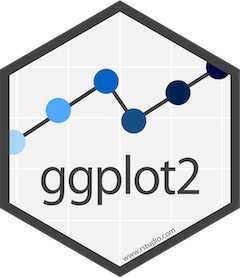

# Bienvenidos y bienvenidas a Estación R

🍀 [Linktree](https://estacion-r.netlify.app/)

🔗 [Web](https://estacion-r.netlify.app/)

------------------------------------------------------------------------

## ¿Qué vimos?

<br>

✅ Conceptos básicos de R

<br>

✅ Pensar un proyecto de datos con R

<br>

✅ Procesamiento de datos con `{tidyverse}`

## Hoja de Ruta

<br>

📌 ¿Por qué visualizar datos?

📌 Gramática de los gráficos y `{ggplot2}`

```         
  - Capas y el operador `+` (más)
```

📌 Armando un gráfico de barras (columnas)

```         
  - Función `geom_col()`
```

📌 Chapa y pintura de un gráfico (atributos)

## Configuración para esta clase

<br>

-   Armar un proyeto de trabajo nuevo o abrir aquel con el que veníamos trabajando

-   Cargar la base del [**Padrón Único Nacional de Alojamientos**](https://datos.yvera.gob.ar/dataset/padron-unico-nacional-alojamiento) (Argentina) y chequear que esté en la carpeta `datos`

-   Crear un **script** de trabajo

-   Carga la librería `{tidyverse}`

# ¿Por qué visualizar datos?

<html>

<hr color='#EB811B' size=1px width=1600px>

</html>

## ¿Por qué visualizar?

<br>

-   *"La visualización es el proceso de hacer visibles los contrastes, ritmos y eventos que los datos expresan, que no podemos percibir cuando vienen en forma de áridas listas de números y categorías."* [^1]

[^1]: https://bitsandbricks.github.io/ciencia_de_datos_gente_sociable/visualizacion.html

<br>

-   Interpretar / decodificar la información de forma visual

<br>

-   Guiar hacia el hallazago

<br>

# ggplot2

<html>

<hr color='#EB811B' size=1px width=1600px>

</html>

<html>

```{=html}
<p style="color:grey;" align:"left">Una forma de visualizar</p>
```
</html>

::: {layout-valign="center"}
{fig-align="center"}
:::

## **¿Qué es `{ggplot2}`?**

<br>

-   Una implementación del sistema **Grammar of graphics** (Wilkinson, 2005).

<br>

-   Un esquema pensado en capas (datos --\> plano (ejes **x** e **y**) --\> geometrías)

<br>

-   Un paquete de funciones de aplicación intuitiva.

## **¿Por qué `{ggplot2}`?**

::: incremental
-   Tiene un marco de referencia (El grammar of graphics)

-   Flexible, con especificaciones a nivel de capas.

-   Sistema de `themes`, que permiten *pulir* la apariencia del gráfico

-   Decenas de extensiones para ampliar la potencia del paquete

-   Comunidad activa y con mucha predisposición a ayudar.
:::

<br>

# ¿A dónde vamos?

```{r}
#| echo: false
library(tidyverse)
df_puna <- read_csv("../../data/puna_base_agregada.csv")
```

::: panel-tabset
### Graphic

```{r}
#| label: example-motivation-basic
#| fig-width: 7
#| fig-height: 4
#| fig-align: "center"
#| echo: false

# Preparo los datos
df_habitaciones_2022 <- df_puna |>
  filter(indice_tiempo == 2022) |> 
  group_by(tipo) |> 
  summarise(habitaciones_n = sum(habitaciones, na.rm = T))

ggplot(data = df_habitaciones_2022,
       mapping = aes(x = tipo, 
                         y = habitaciones_n)) +
  geom_col(aes(fill = tipo)) + 
  geom_text(aes(label = habitaciones_n, 
                vjust = -0.5)) +
  geom_hline(yintercept = 0) +
  labs(title = "Cantidad de habitaciones por tipo de alojamiento",
       subtitle = "Argentina, año 2021",
       x = "",
       y = "Cantidad de habitaciones",
       caption = "Fuente: PUNA - MINTURyDEP",
       fill = "Tipo de alojamiento") + 
  theme_minimal() +
  theme(legend.position = "none")
```

### Code

```{r}
#| label: example-motivation-basic
#| eval: false
```
:::

# ¿Por dónde empezamos?

## Cargamos el paquete

<br>

```{r}
library(ggplot2)
```

<br>

o...

<br>

```{r}
library(tidyverse)
```

## Gráfico en clave de capas

<br>

3 Capas son las indispensables al pensar nuestro gráfico:

## Gráfico en clave de capas

<br>

-   Los **datos** (argumento: `data =`):

    -   El dataframe que sirve de insumo

<br>

## Gráfico en clave de capas

<br>

-   Los **datos** (argumento: `data =`):

    -   El dataframe que sirve de insumo

<br>

-   Las **aesthetics** (función `aes()`:

    -   Defino el vínculo entre los datos y las propiedades visuales (ejes x e y, por ej.)

## Gráfico en clave de capas

<br>

-   Los **datos** (argumento: `data =`):

    -   El dataframe que sirve de insumo

<br>

-   Las **aesthetics** (función `aes()`:

    -   Defino el vínculo entre los datos y las propiedades visuales (ejes x e y, por ej.)

<br>

-   Las **geometrías** (función `geom_*()`:

    -   La geometría con la que se representan los datos

## Gráfico en clave de capas

<br>

-   Pregunta-problema: Quiero representar la cantidad de **habitaciones** por **tipo de alojamiento**, para el **año 2022**

Preparo los datos:

```{r}
#| eval: false
library(tidyverse)
df_puna <- read_csv("data/puna_base_agregada.csv")

df_habitaciones_2022 <- df_puna |>
  filter(indice_tiempo == 2022) |> 
  group_by(tipo) |> 
  summarise(habitaciones_n = sum(habitaciones, na.rm = T))
```

```{r}
#| echo: false
library(tidyverse)
df_puna <- read_csv("../../data/puna_base_agregada.csv")
df_habitaciones_2022 <- df_puna |>
  filter(indice_tiempo == 2022) |> 
  group_by(tipo) |> 
  summarise(habitaciones_n = sum(habitaciones, na.rm = T))
```

## Gráfico en clave de capas

<br>

-   Así queda nuestra tabla:

```{r}
df_habitaciones_2022
```

## Gráfico en clave de capas

```{r}
#| label: ggplot-aesthetics-outside
#| output-location: column
#| code-line-numbers: "1|2"
ggplot(data = df_habitaciones_2022,
       aes(x = tipo, y = habitaciones_n))
  
```

## Gráfico en clave de capas

```{r}
#| label: ggplot-aesthetics-outside-geom
#| output-location: column
#| code-line-numbers: "3"
ggplot(data = df_habitaciones_2022,
       aes(x = tipo, y = habitaciones_n)) +
  geom_col()
  
```

# Chapa y pintura

## Chapa y pintura - Relleno

```{r}
#| label: ggplot-aesthetics-outside-fill
#| output-location: column
#| code-line-numbers: "3"
ggplot(data = df_habitaciones_2022,
       aes(x = tipo, y = habitaciones_n)) +
  geom_col(fill = "red")
```

## Chapa y pintura - Relleno

```{r}
#| label: ggplot-aesthetics-outside-fill-aes
#| output-location: column
#| code-line-numbers: "3"
ggplot(data = df_habitaciones_2022,
       aes(x = tipo, y = habitaciones_n)) +
  geom_col(aes(fill = tipo))
```

## Chapa y pintura - Contorno

```{r}
#| label: ggplot-aesthetics-outside-color
#| output-location: column
#| code-line-numbers: "4"
ggplot(data = df_habitaciones_2022,
       aes(x = tipo, y = habitaciones_n)) +
  geom_col(aes(fill = tipo),
           color = "black")
```

## Chapa y pintura - Referencias

```{r}
#| label: ggplot-aesthetics-outside-labs1
#| output-location: column
#| code-line-numbers: "5"
ggplot(data = df_habitaciones_2022,
       aes(x = tipo, y = habitaciones_n)) +
  geom_col(aes(fill = tipo),
           color = "black") + 
  labs(title = "Cantidad de habitaciones por tipo de alojamiento")
```

## Chapa y pintura - Referencias

```{r}
#| label: ggplot-aesthetics-outside-labs2
#| output-location: column
#| code-line-numbers: "5,6,7,8,9"
ggplot(data = df_habitaciones_2022,
       aes(x = tipo, y = habitaciones_n)) +
  geom_col(aes(fill = tipo),
           color = "black") + 
  labs(title = "Cantidad de habitaciones por tipo de alojamiento",
       subtitle = "Argentina, año 2022",
       x = "",
       y = "Cant. de habitaciones",
       caption = "Fuente: Elaboración propia en base al PUNA-MINTURyDEP")
```

## Chapa y pintura - theme

```{r}
#| label: ggplot-aesthetics-outside-theme
#| output-location: column
#| code-line-numbers: "10"
ggplot(data = df_habitaciones_2022,
       aes(x = tipo, y = habitaciones_n)) +
  geom_col(aes(fill = tipo),
           color = "black") + 
  labs(title = "Cantidad de habitaciones por tipo de alojamiento",
       subtitle = "Argentina, año 2022",
       x = "",
       y = "Cant. de habitaciones",
       caption = "Fuente: Elaboración propia en base al PUNA-MINTURyDEP") +
  theme_minimal()
```

## Chapa y pintura - theme

```{r}
#| label: ggplot-aesthetics-outside-theme2
#| output-location: column
#| code-line-numbers: "11"
ggplot(data = df_habitaciones_2022,
       aes(x = tipo, y = habitaciones_n)) +
  geom_col(aes(fill = tipo),
           color = "black") + 
  labs(title = "Cantidad de habitaciones por tipo de alojamiento",
       subtitle = "Argentina, año 2022",
       x = "",
       y = "Cant. de habitaciones",
       caption = "Fuente: Elaboración propia en base al PUNA-MINTURyDEP") +
  theme_minimal() + 
  theme(legend.position = "none")
```

::::
