# Bienvenidos y bienvenidas a Estación R

🍀 [Linktree](https://estacion-r.netlify.app/)

🔗 [Web](https://estacion-r.netlify.app/)

------------------------------------------------------------------------

## ¿Qué vimos?

<br>

✅ Conceptos básicos de R

<br>

✅ Pensar un proyecto de datos con R

<br>

✅ Procesamiento de datos con `{tidyverse}`

<br>

✅ Visualización de datos con`{ggplot2}`

## Hoja de Ruta

<br>

-   📌️ ¿Qué es Rmarkdown (*spoiler: R + Mardown*)?

<br>

-   📌️ Conceptos básicos de Markdown

<br>

-   📌️ YAML, Chunks y texto

## Configuración para esta clase

<br>

-   Tener instalado (o instalar) el paquete `rmarkdown`:

```         
install.packages("rmarkdown")
```

# Flujo de trabajo para la Ciencia de Datos

::: {layout-valign="center"}
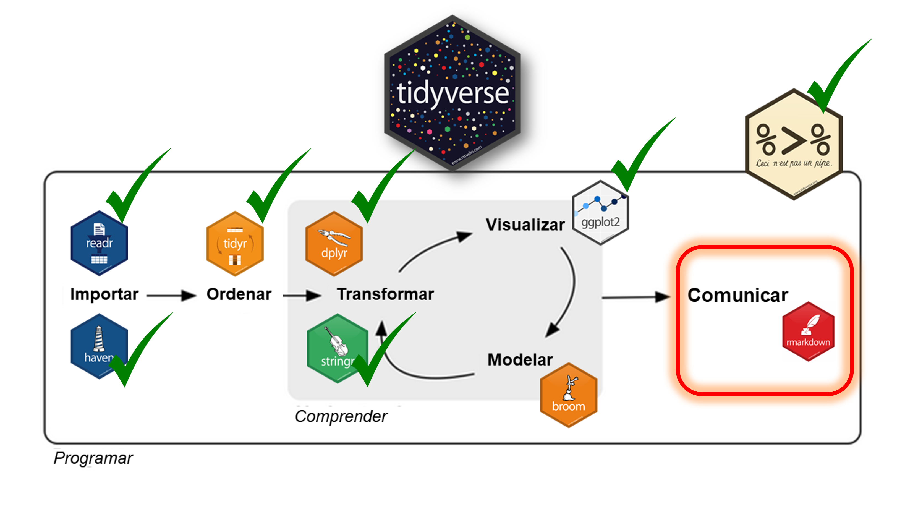{fig-align="center" width="80%"}
:::

# Rmarkdown

<html>

<hr color='#EB811B' size=1px width=1600px>

</html>

<html>

```{=html}
<p style="color:grey;" align:"left">Generación de reportes</p>
```
</html>

::: {layout-valign="center"}
{fig-align="center"}
:::

## R + Rmarkdown

<br><br>

> Rmarkdown es un formato de Rstudio que permite combinar la **sintaxis de Markdown** para escritura de texto plano con la **sintáxis de R** para el procesamiento de datos.

::: {layout-valign="center"}
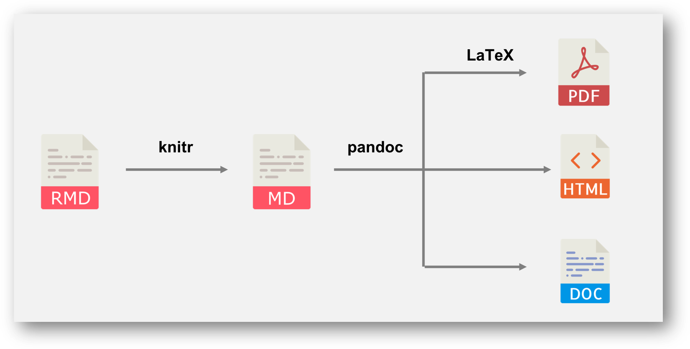{fig-align="center" width="50%"}
:::

## Hasta ahora...

::: {layout-valign="center"}
{fig-align="center" width="35%"}
:::

## Hasta ahora...

::: {layout-valign="center"}
{fig-align="center" width="35%"}
:::

## Hasta ahora...

::: {layout-valign="center"}
{fig-align="center" width="35%"}
:::

## Hasta ahora...

::: {layout-valign="center"}
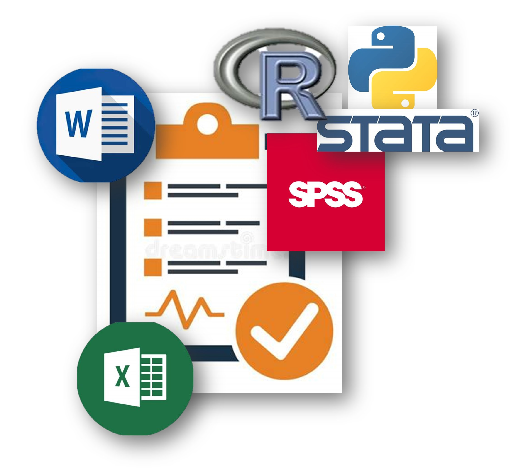{fig-align="center" width="45%"}
:::

## Hasta ahora...

::: {layout-valign="center"}
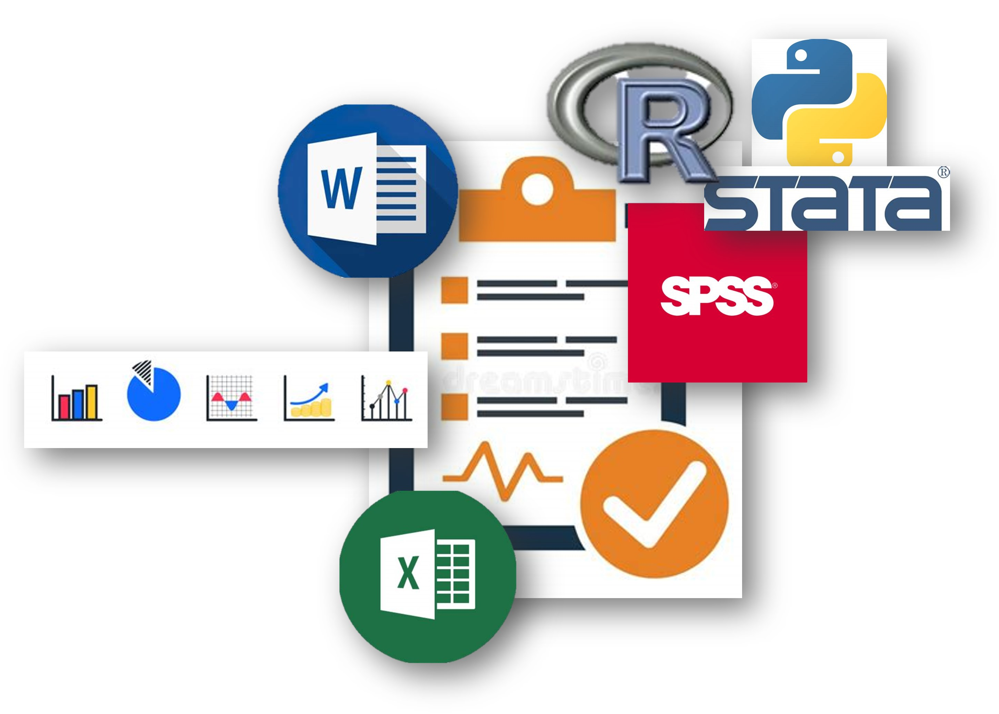{fig-align="center" width="45%"}
:::

## Hasta ahora...

::: columns
::: {.column width="50%"}
::: {layout-valign="center"}
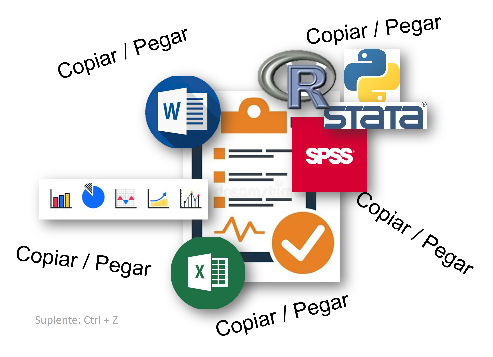{fig-align="center"}
:::
:::

::: {.column width="50%"}
::: {layout-valign="center"}
{fig-align="center" width="150%"}
:::
:::
:::

## Desventajas del "hasta ahora..."

::: incremental
-   Decenas, cientos, miles de versiones. `informe_FINAL_FINAL_FINAL_V2_1.doc`

-   I-rreproducible
:::

## Desventajas del "hasta ahora..."

-   Decenas, cientos, miles de versiones. `informe_FINAL_FINAL_FINAL_V2_1.doc`

-   I-rreproducible

::: columns
::: {.column widht="50%"}
-   ¿Mismo informe con nuevos datos?
:::

::: {.column widht="50%"}
::: {layout-valign="center"}
{fig-align="center" width="70%"}
:::
:::
:::

## Rmarkdown

::: columns
::: {.column width="50%"}
#### Antes:

::: {layout-valign="center"}
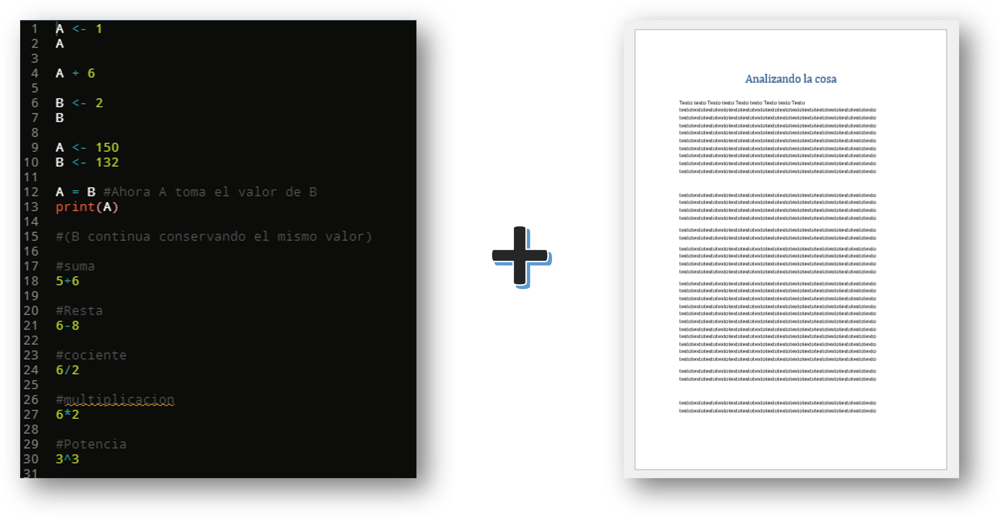{fig-align="center" width="110%"}
:::
:::

::: {.column width="50%"}
#### Después:

::: {layout-valign="center"}
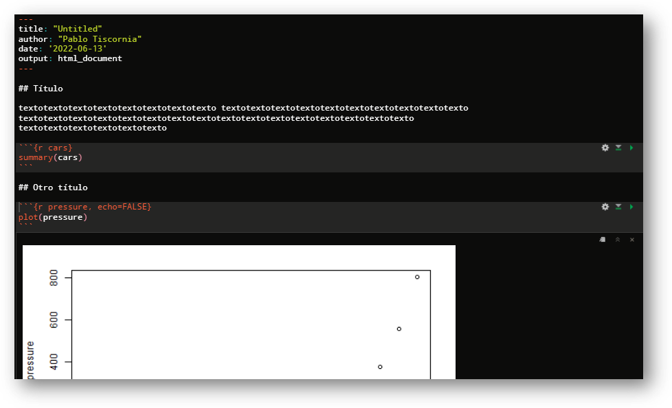{fig-align="center" width="110%"}
:::
:::
:::

## Rmarkdown - Formatos de salida

::: {layout-valign="center"}
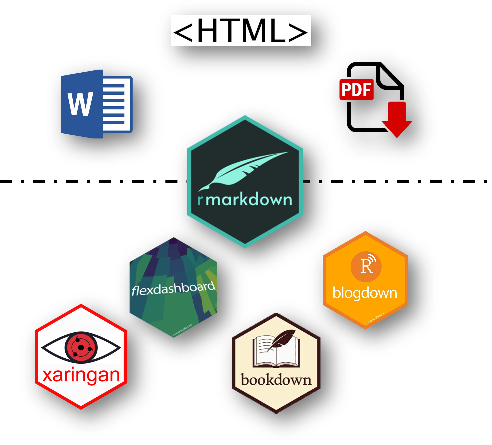{fig-align="center" width="50%"}
:::

## Rmarkdown - Nuevo archivo

::: {layout-valign="center"}
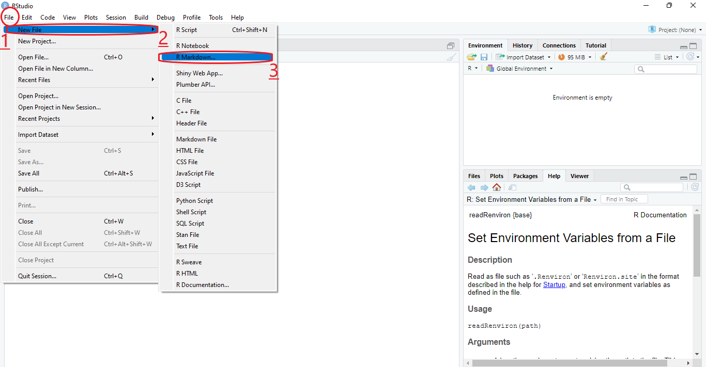
:::

## Rmarkdown - Componentes

::: {layout-valign="center"}
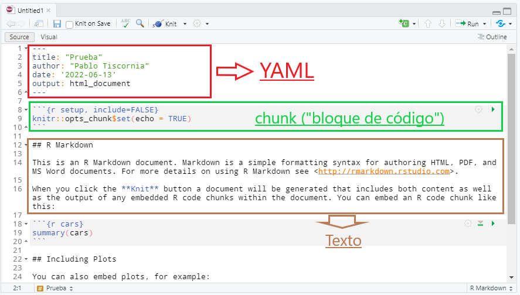
:::

# 1. YAML (metadata o encabezado)

<br><br>

::: {layout-valign="center"}
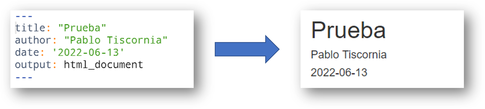{fig-align="center"}
:::

## 2. Chunk (o bloque de código)

<br><br>

::: {layout-valign="center"}
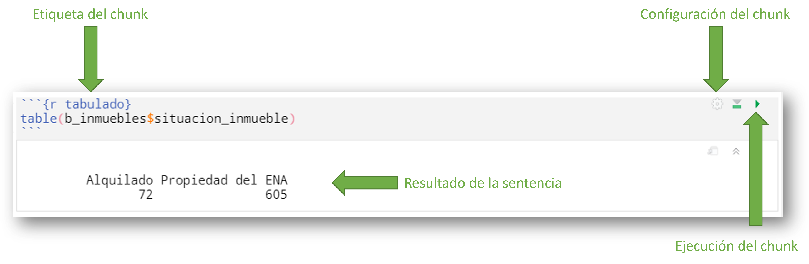{fig-align="center"}
:::

## 2. Chunk (o bloque de código)

<br><br>

::: {layout-valign="center"}
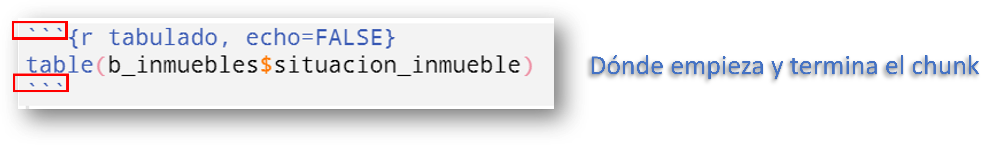{fig-align="center"}
:::

## 2. Chunk (o bloque de código)

<br><br>

::: {layout-valign="center"}
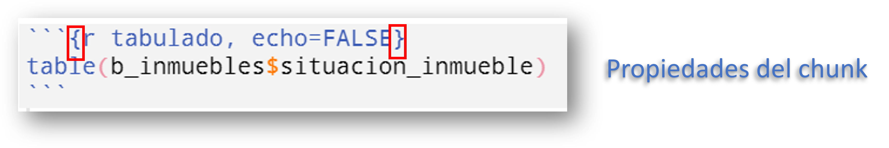{fig-align="center"}
:::

## 2. Chunk (o bloque de código)

::: {layout-valign="center"}
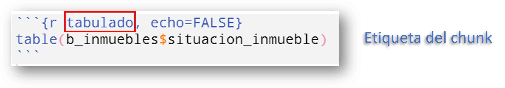{fig-align="center"}
:::

## 2. Chunk (o bloque de código)

::: {layout-valign="center"}
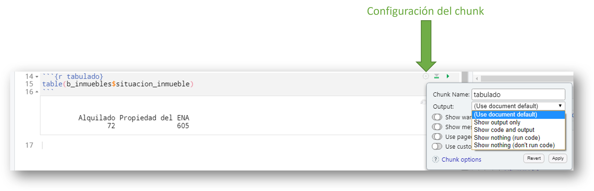{fig-align="center"}
:::

## 2. Chunk (o bloque de código)

| **Función**                         | **Acción**                                                     |
|:--------------------------|:--------------------------------------------|
| `{r echo = FALSE}`                  | *Muestra sólo resultado del chunk*                             |
| `{r echo = TRUE}`                   | *Muestra código y resultado del chunk*                         |
| `{r eval = FALSE}`                  | *Muestra código pero no ejecuta*                               |
| `{r include = FALSE}`               | *No muestra nada (ni código ni resultado) pero ejecuta código* |
| `{r eval = FALSE, include = FALSE}` | *No muestra nada (ni código ni resultado) - tampoco ejecuta*   |

## 2. Chunk (o bloque de código)

::: incremental
::: {layout-valign="center"}
-   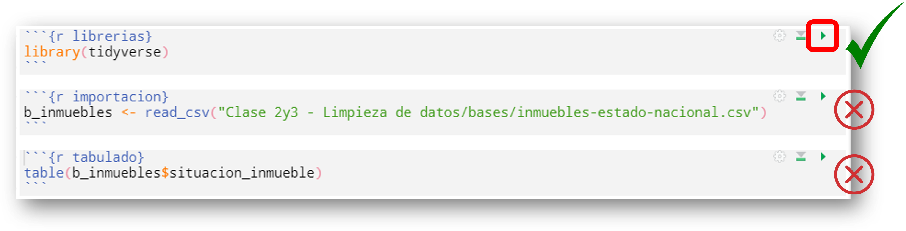{fig-align="center" width="60%"}
:::

::: {layout-valign="center"}
-   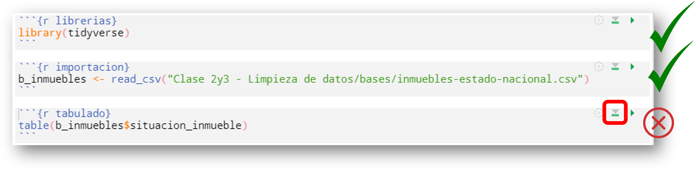{fig-align="center" width="60%"}
:::
:::

## 2. Chunk (o bloque de código)

::: {layout-valign="center"}
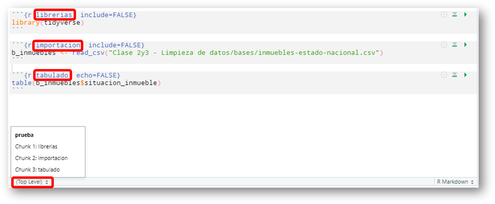{fig-align="center" width="60%"}
:::

# 3. Texto

::: {layout-valign="center"}
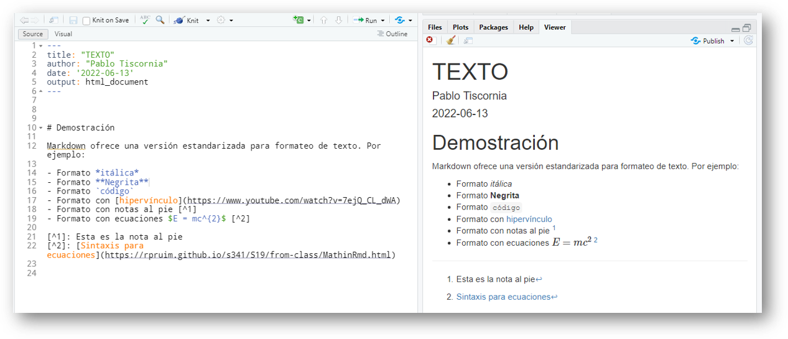{fig-align="center" width="60%"}
:::

## 3. Texto + código (en texto)

::: {layout-valign="center"}
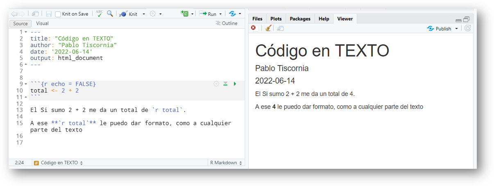{fig-align="center" width="60%"}
:::

# Práctica

## Práctica

1)  Crear un informe que contenga:

-   **En TEXTO:**
    -   Una estructura mínima de texto (Título, consigna, descripción de las tareas realizadas y muy breve conclusión)
-   **En CÓDIGO:**
    -   Carga de librerías (no mostrar el código en el reporte)
    -   Importación de datos (mostrar el código en el reporte)
    -   Algún procesamiento mínimo como filtrar, seleccionar, generar un tabulado, etc. (mostrar el código y el resultado en el reporte)
-   *Extra*: Incluir un gráfico

## RECURSOS

-   [Guía de comandos para texto en Rmarkdown](https://www.rstudio.com/wp-content/uploads/2015/03/rmarkdown-reference.pdf?_ga=2.157796986.1542626288.1625161001-1806201684.1624641897)

-   [Guía definitiva de Rmarkdown (en inglés)](https://bookdown.org/yihui/rmarkdown/)

-   [Machete Rmarkdown](https://raw.githubusercontent.com/rstudio/cheatsheets/main/rmarkdown.pdf)

-   [Cocina de Rmarkdown (en inglés)](https://bookdown.org/yihui/rmarkdown-cookbook/)
